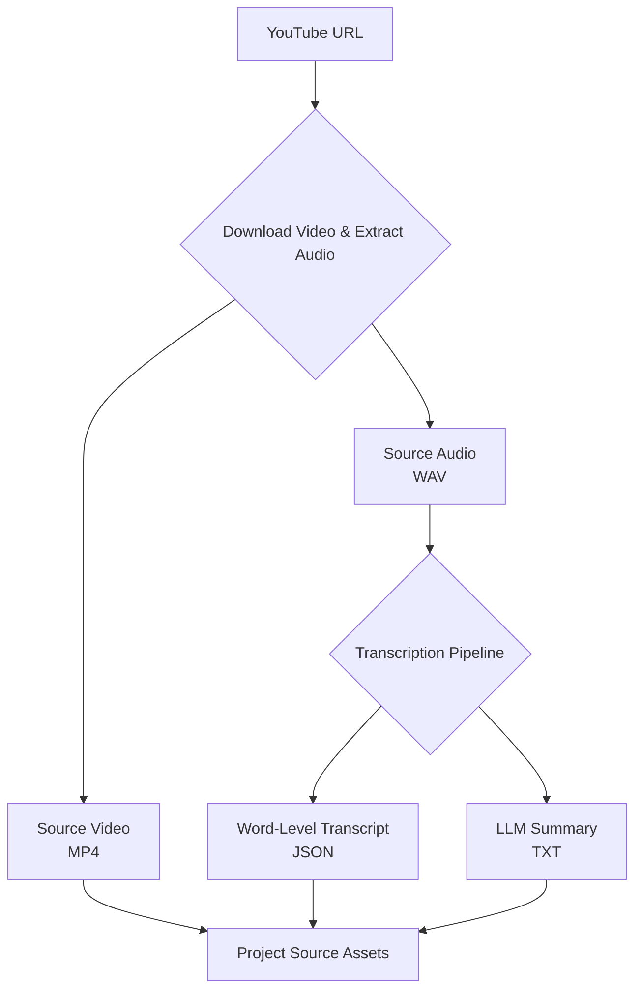

# HookGen: AI-Powered Video Hook Generator

## Overview

HookGen is an innovative, AI-driven video production pipeline designed to transform long-form video content into engaging, short-form "hooks" optimized for social media platforms. Leveraging advanced audio and visual analysis, natural language processing, and intelligent editing techniques, HookGen automates the tedious process of identifying compelling moments, extracting them, and applying dynamic edits to maximize viewer retention.

This project serves as a comprehensive demonstration of a production-quality video processing system, emphasizing modularity, readability, robust error handling, and extensibility.

## Features

*   **Automated Hook Extraction**: Automatically identifies and extracts high-impact segments from long-form videos.
*   **Intelligent Blueprint Generation**: Utilizes Large Language Models (LLMs) to create a "shot list" or production blueprint based on a creative brief and video transcript.
*   **Active Speaker Detection (ASD) & Smart Cropping**: Employs face detection and voice activity detection to keep the active speaker consistently in frame with dynamic vertical cropping.
*   **Filler Word Removal**: Automatically detects and removes common filler words (e.g., "um," "uh") with a subtle "punch-in" zoom effect to create seamless, professional-sounding cuts.
*   **Modular Pipeline Design**: A highly modular architecture allows for easy integration of new features, models, or transcription services.
*   **Comprehensive Logging**: Detailed logging for every stage of the pipeline ensures reproducibility and simplifies debugging.

## How It Works

The HookGen pipeline operates in two main stages: **Preparation** and **Production**.

### 1. Preparation Stage (`prepare.py`)

This stage is responsible for gathering and processing all raw assets required for video production.

**Workflow:**

1.  **Video Download & Audio Extraction**: Downloads the source video (e.g., from YouTube) and extracts its audio track into a high-quality WAV file suitable for analysis.
2.  **Transcription**: The extracted audio is transcribed to produce a highly accurate, word-level transcript using WhisperX.
3.  **LLM Summary**: A concise summary of the transcript is generated for use in high-level content analysis or for generating a creative brief.

**Diagram: Preparation Stage**



### 2. Production Stage (`main.py`)

This is the core video processing stage, where the raw assets are transformed into the final video hook.

**Workflow:**

1.  **Setup & Asset Loading**: Initializes logging, sets up the run-specific output directory, and loads the source video, transcript, and creative brief.
2.  **Blueprint Creation**: The `pipeline.Blueprint` module takes the creative brief and the detailed transcript to identify the precise start and end times for each desired clip.
3.  **Per-Clip Processing Loop**: Each clip defined in the blueprint undergoes a series of transformations:
    *   **Segment Extraction**: The exact video and audio segment for the clip are extracted from the source files.
    *   **Active Speaker Detection (ASD) & Cropping**: If enabled, the pipeline determines the active speaker and dynamically crops the video to keep them centered in a vertical format.
    *   **Filler Word Removal**: If enabled, filler words are identified within the clip's transcript, and those segments are removed with a subtle "punch-in" zoom effect to hide the cut.
4.  **Final Assembly**: All processed and edited clips are concatenated into a single, seamless final video hook.

**Diagram: Production Stage**

```mermaid
graph TD
    subgraph "Preparation Stage (prepare.py)"
        A[YouTube URL] --> B{Download Video & Extract Audio}
        B --> C["Source Video - MP4"]
        B --> D["Source Audio - WAV"]
        D --> E{Transcription Process}
        E --> F["Raw Deepgram JSON"]
        E --> G["LLM Summary - TXT"]
        E --> H["WhisperX-compatible Transcript - JSON"]
        C --> I[Project Source Assets]
        F --> I
        G --> I
        H --> I
    end

    subgraph "Production Stage (main.py)"
        I --> J{Initialization & Asset/Model Loading}
        J --> K{Blueprint Creation}
        K --> L[Final Blueprint - Clip List]

        subgraph "Per-Clip Processing Loop"
            M{For Each Clip in Blueprint}
            M --> N{Segment Extraction - VideoIO.extract_segment_reencode}
            N --> O[Segment Video]
            N --> P[Segment Audio]

            subgraph "Active Speaker Detection & Cropping - perform_asd_and_crop"
                O --> Q{Face Detection - VisionAnalysis.detect_faces_in_video_segment}
                P --> Q

                Q --> R["Raw Face Detections - Cached"]
                R --> S{Face Tracking - VisionAnalysis.apply_face_tracking}
                S --> T["Tracked Faces - IDs"]
                P --> U{Voice Activity Detection - AudioAnalysis.get_speech_segments_from_vad}
                T --> V{Mouth Activity - VisionAnalysis.get_mouth_activity_per_track}
                U --> W{Active Speaker Determination - VisionAnalysis.determine_active_speaker_ids}
                V --> W
                W --> X["Active Speaker IDs per Frame"]
                X --> Y{Single Speaker Heuristics - VisionAnalysis.enforce_single_speaker_heuristics}
                T --> Y
                Y --> Z["Final Speaker IDs"]
                Z --> AA{Crop Calculation & Application - EditingEffects.create_speaker_focused_cropped_clip}
                O --> AA
                AA --> AB["Cropped Segment Video"]
            end

            AB --> AC{Filler Word Removal - EditingEffects.refine_clip_by_removing_fillers}
            AC --> AD["Refined Segment Video"]
            AD --> AE{Collect Processed Clips}
        end

        L --> M
        AE --> AF{Final Assembly - VideoIO.concatenate_video_clips}
        AF --> AG["Final Video Hook - MP4"]
    end
```




## Project Structure

```
HookGen/
├── main.py                 # Main entry point for the Production Stage
├── prepare.py              # Entry point for the Preparation Stage
├── README.md               # This file
├── inputs/                 # Default location for creative briefs
├── output/                 # Contains all project outputs
│   └── [project_name]/
│       ├── source_assets/  # Raw video, audio, and transcript files
│       └── runs/           # Individual production runs
│           └── [run_name]/ # Log files, intermediate clips, final video
└── pipeline/               # Core logic modules
    ├── __init__.py
    ├── AudioAnalysis.py    # Speaker diarization, silence detection
    ├── Blueprint.py        # Blueprint generation from creative brief
    ├── config.py           # Centralized configuration settings
    ├── CropProcessing.py   # Crop calculation logic
    ├── EditingEffects.py   # Video editing (zoom, filler word removal)
    ├── GetTranscript.py    # Transcription service integration
    ├── LoggerSetup.py      # Logging configuration
    ├── TranscriptParser.py # Utilities for transcript manipulation
    ├── utils.py            # General utility functions
    ├── VideoIO.py          # Segment extraction, concatenation
    └── VisionAnalysis.py   # Face detection and analysis
```

## Setup and Usage

### Prerequisites

*   Python 3.8+
*   FFmpeg (must be installed and accessible in your system's PATH)
*   An `.env` file in the project root containing your API keys:
    ```
    HUGGING_FACE_TOKEN="your_hf_token_here"
    DEEPGRAM_API_KEY="your_deepgram_key_here"
    ```

### Installation

1.  **Clone the repository:**
    ```bash
    git clone https://github.com/your-username/HookGen.git
    cd HookGen
    ```

2.  **Install `uv`:**
    ```bash
    pip install uv
    ```

3.  **Create the virtual environment and install dependencies:**
    ```bash
    uv venv
    uv sync
    ```

### Running the Pipeline

Commands are executed using `uv run`.

**Step 1: Prepare Assets**

Use `prepare.py` to download the source video and generate the necessary transcripts.

```bash
uv run python prepare.py --project-name "my-project" --url "https://www.youtube.com/watch?v=..."
```

**Step 2: Run the Production Pipeline**

Once assets are prepared, run the main production script. You can use a pre-existing creative brief or let the pipeline generate one.

**Example Run:**

```bash
# This command runs the pipeline on "my-project", creates a run named "first-run", enables the GPU, and disables cropping.
uv run python main.py --project-name "my-project" --run-name "first-run" --use-gpu --no-crop
```

**`main.py` Arguments:**

*   `--project-name`: The name of the project folder. **(Required)**
*   `--run-name`: A unique name for the production run. (Defaults to a timestamp).
*   `--use-gpu`: (Flag) Enable GPU acceleration for face detection.
*   `--no-crop`: (Flag) Disable vertical cropping and Active Speaker Detection.
*   `--use-custom-clips`: Path to a custom JSON file with clip definitions, skipping LLM generation.
*   `--custom-instructs`: Custom instructions for the 'general' clip generation template.
*   `--use-template`: The template for LLM-based clip generation (`rapidfire`, `general`, etc.).

The final video will be saved in `output/[project_name]/runs/[run_name]/final_video.mp4`.

## Future Enhancements

*   **Automatic Subtitle Generation**: Integrate a module to automatically generate and burn-in subtitles.
*   **B-Roll/Stock Footage Integration**: Develop a system to automatically insert relevant B-roll based on transcript keywords.
*   **Background Music & Sound Effects**: Add capabilities for intelligent background music selection and sound effect integration.
*   **Web UI**: Develop a user-friendly web interface for easier interaction with the pipeline.